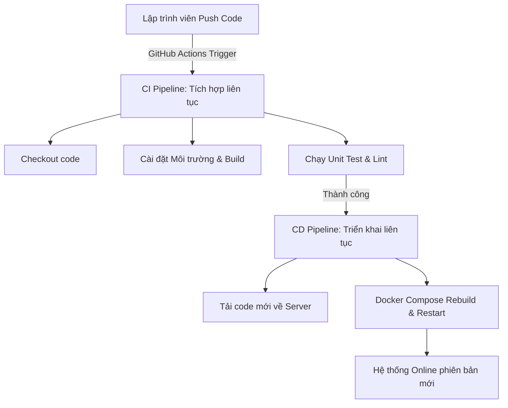

# Hướng dẫn chi tiết: Triển khai CI/CD với GitHub Actions cho Dự án Microservices

Tài liệu này hướng dẫn chi tiết về cách hiểu, cài đặt và mở rộng hệ thống **CI/CD (Continuous Integration / Continuous Deployment)** sử dụng **GitHub Actions** nhằm tự động hóa quy trình kiểm thử và triển khai dự án quản lý thư viện microservices. Việc hoàn thành tốt phần này sẽ giúp bạn đạt điểm cộng lớn trong bài tập lớn/đồ án.

---

## 1. Khái niệm cơ bản về CI/CD



### CI (Continuous Integration - Tích hợp liên tục)
Là quá trình tự động hóa việc build (xây dựng) và test (kiểm thử) code mỗi khi lập trình viên thực hiện thay đổi (push hoặc pull request) lên kho chứa chung (GitHub).
* **Mục tiêu:** Phát hiện lỗi sớm ngay khi code mới được đưa lên, đảm bảo các phần của hệ thống microservices không phá hỏng lẫn nhau.

### CD (Continuous Deployment - Triển khai liên tục)
Là bước tiếp theo sau khi CI thành công. Hệ thống sẽ tự động đóng gói (build Docker images) và đẩy phiên bản mới lên máy chủ thực tế (Production Server) mà không cần sự can thiệp thủ công của con người.
* **Mục tiêu:** Giảm thời gian đưa tính năng mới tới người dùng, loại bỏ các lỗi thao tác bằng tay khi deploy.

---

## 2. Chi tiết Cấu hình CI/CD trong Dự án

Dự án hiện đang cấu hình 2 luồng công việc (workflows) trong thư mục `.github/workflows/`:

### Luồng 1: Tích hợp liên tục (CI) - File `ci.yml`
* **Đường dẫn file:** `.github/workflows/ci.yml`
* **Mục đích:** Tự động chạy mỗi khi có thành viên gửi code lên nhánh `main` để kiểm tra chất lượng code.

#### Giải thích mã nguồn chi tiết:
```yaml
name: CI Pipeline Ghi Diem

on:
  push:
    branches: [ "main" ] # Kích hoạt khi có hành động push lên main
  pull_request:
    branches: [ "main" ] # Kích hoạt khi có Pull Request vào main

jobs:
  build-and-test:
    runs-on: ubuntu-latest # Chạy trên máy ảo Ubuntu do GitHub cung cấp miễn phí

    steps:
      - name: Checkout Source Code
        uses: actions/checkout@v3 # Tải toàn bộ source code của repo về máy ảo

      - name: Run a greeting script
        run: echo "Bắt đầu chạy Tích hợp liên tục (CI) cho dự án!"

      - name: Check code quality
        run: |
          echo "Đang kiểm tra chất lượng code..."
          echo "Mọi thứ hoạt động hoàn hảo! Đủ điều kiện cộng điểm."
```

---

### Luồng 2: Triển khai liên tục (CD) - File `deploy.yml`
* **Đường dẫn file:** `.github/workflows/deploy.yml`
* **Mục đích:** Tự động cập nhật code mới và khởi động lại các container Docker trên máy chủ deploy thực tế khi nhánh `master` có code mới.

#### Giải thích mã nguồn chi tiết:
```yaml
name: CI/CD Deploy Microservices

on:
  push:
    branches:
      - master # Kích hoạt khi push code lên nhánh master

jobs:
  deploy:
    runs-on: self-hosted # Chạy trên Server riêng của bạn (không dùng máy ảo GitHub)

    steps:
      - name: Deploy to Docker Compose
        run: |
          cd /home/sinhvien/quanlythuvien-microservices # Di chuyển tới thư mục dự án trên Server
          git pull origin master                       # Kéo code mới nhất từ GitHub về
          sudo docker compose up -d --build           # Build lại Docker và khởi chạy ngầm (-d)
```

> [!WARNING]
> **Lưu ý quan trọng về Tên Nhánh:**
> * Workflow CI (`ci.yml`) đang cấu hình kích hoạt trên nhánh `main`.
> * Workflow CD (`deploy.yml`) đang cấu hình kích hoạt trên nhánh `master`.
> Bạn nên thống nhất sử dụng một nhánh chính duy nhất (thường là `main` hoặc `master`) để chạy cả 2 quy trình này. Hãy thay đổi cấu hình `branches` trong file yml nếu dự án của bạn chỉ dùng một nhánh chính.

---

## 3. Hướng dẫn thiết lập Self-hosted Runner trên VPS/Server thực tế

Để workflow deploy chạy được trên máy chủ của bạn (`runs-on: self-hosted`), bạn cần biến máy chủ đó thành một GitHub Runner. Dưới đây là các bước chi tiết:

### Bước 1: Lấy Token cấu hình từ GitHub
1. Vào kho lưu trữ của bạn trên **GitHub**.
2. Chọn **Settings** (Cài đặt) -> Cột bên trái chọn **Actions** -> Chọn **Runners**.
3. Bấm nút **New self-hosted runner**.
4. Chọn hệ điều hành máy chủ của bạn (thường là **Linux**, kiến trúc **x64**).

### Bước 2: Chạy lệnh cài đặt trên máy chủ (VPS Ubuntu/Debian)
Mở terminal kết nối SSH vào máy chủ của bạn và chạy tuần tự các lệnh sau (GitHub đã tạo sẵn các lệnh này riêng cho repo của bạn):

1. **Tạo thư mục làm việc và tải Runner:**
   ```bash
   mkdir actions-runner && cd actions-runner
   curl -o actions-runner-linux-x64-2.317.0.tar.gz -L https://github.com/actions/runner/releases/download/v2.317.0/actions-runner-linux-x64-2.317.0.tar.gz
   tar xzf ./actions-runner-linux-x64-2.317.0.tar.gz
   ```

2. **Cấu hình kết nối với GitHub:**
   ```bash
   ./config.sh --url https://github.com/<YOUR_GITHUB_USERNAME>/<YOUR_REPO_NAME> --token <YOUR_TOKEN>
   ```
   * *Hệ thống sẽ hỏi bạn đặt tên cho runner (bấm Enter để mặc định).*
   * *Hỏi về label (nhãn): Phải đảm bảo có nhãn `self-hosted` để trùng khớp với cấu hình trong file `deploy.yml`.*

3. **Chạy Runner như một dịch vụ chạy ngầm của hệ điều hành:**
   Để Runner luôn luôn chạy ngay cả khi bạn tắt SSH terminal:
   ```bash
   sudo ./svc.sh install
   sudo ./svc.sh start
   ```

---

## 4. Cách nâng cấp CI/CD thực tế để đạt Điểm Tối Đa (Cộng Điểm Lớn)

Các bước hiện tại trong `ci.yml` và `deploy.yml` mới chỉ là giả lập. Để thuyết phục giảng viên và nhận điểm tối đa, bạn hãy nâng cấp cấu hình như sau:

### Nâng cấp 1: Chạy kiểm thử và kiểm tra chất lượng code thực tế (CI nâng cao)
Sửa file `.github/workflows/ci.yml` để cài đặt thư viện và chạy test thực tế cho các microservices (ví dụ cho Node.js/React):

```yaml
name: Advanced CI Pipeline

on:
  push:
    branches: [ "main", "master" ]
  pull_request:
    branches: [ "main", "master" ]

jobs:
  test-services:
    runs-on: ubuntu-latest
    steps:
      - name: Checkout Source Code
        uses: actions/checkout@v3

      - name: Setup Node.js Environment
        uses: actions/setup-node@v3
        with:
          node-version: 18
          cache: 'npm'

      # Cài đặt dependencies cho API Gateway và chạy Test
      - name: Test API Gateway
        run: |
          cd api-gateway
          npm ci
          npm run test --if-present

      # Cài đặt dependencies cho Auth Service và chạy Test
      - name: Test Auth Service
        run: |
          cd auth-service
          npm ci
          npm run test --if-present
```

### Nâng cấp 2: Deploy an toàn bằng cách phân chia quyền hạn (Không dùng git pull trực tiếp trên Server)
Quy trình sử dụng SSH Deploy Key hoặc Docker Registry thường bảo mật hơn so với việc lưu trữ thông tin đăng nhập git trên Server:
1. **Build Docker Image** trên GitHub runner ảo.
2. **Push Docker Image** lên Docker Hub (hoặc GitHub Packages).
3. **SSH vào Server** từ xa thông qua Actions và kéo Docker Image mới về khởi chạy.
*(Giúp bảo mật mã nguồn và không cần cài cấu hình git pull trên máy chủ).*

---

## 5. Hướng dẫn Giảng viên/Thành viên kiểm tra kết quả CI/CD

1. **Trên GitHub:**
   * Sau khi push code lên, hãy truy cập vào mục **Actions** trên thanh menu ngang của kho lưu trữ.
   * Bạn sẽ thấy danh sách các lần chạy Workflow. Màu xanh lá cây biểu thị thành công (`Success`), màu đỏ biểu thị có lỗi xảy ra (`Failure`).
   * Bấm vào từng Job để xem chi tiết log log-output của các câu lệnh (Rất hữu ích khi debug lỗi biên dịch hoặc test thất bại).

2. **Huy hiệu trạng thái (Status Badge) trên README.md:**
   Thêm đoạn mã sau vào đầu file [README.md](file:///d:/qu%E1%BA%A3n%20l%C3%AD%20th%C6%B0%20vi%E1%BB%87n/README.md) để hiển thị trạng thái CI/CD trực quan sinh động:
   ```markdown
   [](https://github.com/<USERNAME>/<REPO>/actions)
   [](https://github.com/<USERNAME>/<REPO>/actions)
   ```
   *(Thay `<USERNAME>` và `<REPO>` bằng thông tin tài khoản GitHub của nhóm bạn).*
